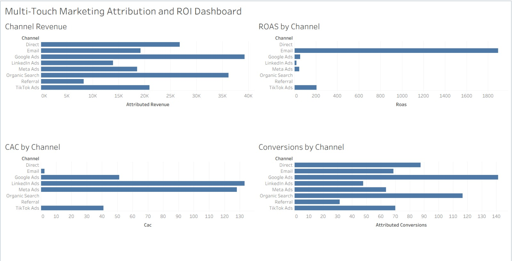

# 📊 Multi-Touch Marketing Attribution & ROI Dashboard

> A data analytics internship project that explains **which marketing channels truly drive conversions, revenue, ROAS, and CAC** using First-Touch, Last-Touch, and Linear Attribution models.

---

## 👤 Project Information

**Project Name:** Multi-Touch Marketing Attribution and ROI Dashboard
**Submitted By:** Chaitanya Pawar
**Organization:** Infotact Solutions & Co.
**Domain:** Marketing Analytics / Data Analytics
**Tools Used:** Python, Pandas, NumPy, SQL, Google Colab, Tableau

---

## 🚀 Project Overview

Modern businesses spend money across multiple marketing channels such as **Google Ads, Meta Ads, TikTok Ads, LinkedIn Ads, Email, Organic Search, Referral, and Direct traffic**.

But customers rarely convert after seeing only one ad.

A typical customer journey may look like this:

```text
Meta Ads → Organic Search → Email → Google Ads → Conversion
```

Traditional **Last-Click Attribution** gives all credit to the final channel. This can mislead marketing teams because earlier touchpoints may have played an important role in influencing the customer.

This project solves that problem by creating a **Multi-Touch Attribution model** and an interactive **Tableau ROI Dashboard**.

---

## 🎯 Business Problem

Marketing teams need to answer:

* Which channel brings the highest attributed revenue?
* Which channel gives the best ROAS?
* Which channel has the lowest CAC?
* Which attribution model changes the business decision?
* Where should the marketing budget be increased or reduced?

This project helps answer these questions using data.

---

## 🧠 Attribution Models Used

### 1. First-Touch Attribution

The first marketing channel in a converted customer journey gets full credit.

```text
Google Ads → Email → Direct → Conversion
```

Credit goes to:

```text
Google Ads
```

### 2. Last-Touch Attribution

The last marketing channel before conversion gets full credit.

```text
Google Ads → Email → Direct → Conversion
```

Credit goes to:

```text
Direct
```

### 3. Linear Attribution

All touchpoints in the customer journey share credit equally.

```text
Google Ads → Email → Direct → Conversion
```

Credit is shared between:

```text
Google Ads + Email + Direct
```

---

## 📁 Project Folder Structure

```text
multi_touch_attribution_roi_dashboard
│
├── data
│   ├── multi_touch_attribution_dataset.csv
│   ├── cleaned_multi_touch_attribution_dataset.csv
│   ├── attribution_model_output.csv
│   └── attribution_channel_summary.csv
│
├── notebooks
│   ├── 01_data_cleaning_and_eda.ipynb
│   └── 03_kpi_calculation_and_modeling.ipynb
│
├── sql
│   └── 02_attribution_model_queries.sql
│
├── dashboard
│   └── multi_touch_attribution_dashboard.twbx
│
├── reports
│   ├── multi_touch_attribution_roi_report.docx
│   ├── multi_touch_attribution_roi_report.pdf
│   └── dashboard_screenshot.png
│
├── presentation
│   └── multi_touch_attribution_roi_presentation.pptx
│
├── README.md
└── requirements.txt
```

---

## 🗂️ Dataset Description

The dataset contains customer journey-level marketing touchpoint data.

### Key Columns

| Column                | Description                                     |
| --------------------- | ----------------------------------------------- |
| `event_id`            | Unique event ID                                 |
| `user_id`             | Unique customer/user ID                         |
| `journey_id`          | Complete journey of one customer                |
| `session_id`          | Session-level identifier                        |
| `event_timestamp_utc` | Timestamp of the marketing touchpoint           |
| `channel`             | Marketing channel                               |
| `campaign`            | Campaign name                                   |
| `funnel_stage`        | Awareness, Consideration, Decision, or Purchase |
| `ad_spend`            | Marketing cost for touchpoint                   |
| `is_conversion`       | 1 if conversion happened, else 0                |
| `conversion_value`    | Revenue generated from conversion               |
| `device`              | User device                                     |
| `region`              | User region                                     |

---

## 📌 Dataset Snapshot

| Metric                   | Value |
| ------------------------ | ----: |
| Total Touchpoint Records | 1,926 |
| Total Columns            |    26 |
| Total Customer Journeys  |   500 |
| Converted Journeys       |   209 |
| Marketing Channels       |     8 |

---

## 🧹 Data Cleaning Process

The data was cleaned using Python and Pandas.

Main cleaning steps:

1. Loaded the CSV dataset in Google Colab.
2. Converted timestamp columns into proper datetime format.
3. Converted `ad_spend` and `conversion_value` into numeric format.
4. Removed duplicate `event_id` records.
5. Sorted records by `journey_id` and `event_timestamp_utc`.
6. Saved the cleaned dataset for further analysis.

Output file:

```text
cleaned_multi_touch_attribution_dataset.csv
```

---

## 🧮 KPI Metrics Calculated

| KPI                    | Formula                                         |
| ---------------------- | ----------------------------------------------- |
| Total Spend            | Sum of `ad_spend`                               |
| Attributed Revenue     | Revenue assigned by attribution model           |
| Attributed Conversions | Conversion credit assigned by attribution model |
| ROAS                   | Attributed Revenue ÷ Total Spend                |
| CAC                    | Total Spend ÷ Attributed Conversions            |

---

## 🧾 SQL Logic

SQL was used to show how customer journeys can be ranked and analyzed using window functions.

Main SQL concepts used:

* `ROW_NUMBER()`
* `PARTITION BY`
* `ORDER BY`
* First-touch ranking
* Last-touch ranking
* Channel-level aggregation
* ROAS and CAC calculation

SQL file:

```text
sql/02_attribution_model_queries.sql
```

---

## 📊 Tableau Dashboard

The final dashboard was created in Tableau.

### Dashboard Charts

| Chart                  | Purpose                                       |
| ---------------------- | --------------------------------------------- |
| Channel Revenue        | Shows attributed revenue by marketing channel |
| ROAS by Channel        | Shows return on ad spend                      |
| CAC by Channel         | Shows customer acquisition cost               |
| Conversions by Channel | Shows attributed conversions                  |

### Dashboard Preview



---

## 🔍 Key Insights

Based on the dashboard:

* **Google Ads** shows strong attributed revenue and conversions.
* **Organic Search** performs well in revenue contribution.
* **Email** shows very high ROAS because of low spend and strong revenue impact.
* **LinkedIn Ads and Meta Ads** show higher CAC, meaning they are more expensive for acquiring customers.
* Different attribution models can change how marketing performance is interpreted.

---

## 🧠 Business Recommendations

1. Increase investment in channels with high ROAS and strong conversions.
2. Monitor high-CAC channels carefully before increasing budget.
3. Do not depend only on Last-Touch Attribution.
4. Use Linear Attribution for a fairer view of the complete customer journey.
5. Review campaigns regularly to reduce wasted ad spend.

---

## 🛠️ How to Run This Project

### Step 1: Clone the Repository

```bash
git clone https://github.com/your-username/multi_touch_attribution_roi_dashboard.git
```

### Step 2: Install Required Libraries

```bash
pip install -r requirements.txt
```

### Step 3: Open the Notebooks

Open the notebooks in Jupyter Notebook or Google Colab:

```text
notebooks/01_data_cleaning_and_eda.ipynb
notebooks/03_kpi_calculation_and_modeling.ipynb
```

### Step 4: Open Tableau Dashboard

Open this file in Tableau:

```text
dashboard/multi_touch_attribution_dashboard.twbx
```

---

## 📦 Final Deliverables

| Deliverable       | Status    |
| ----------------- | --------- |
| Cleaned Dataset   | Completed |
| Python Notebooks  | Completed |
| SQL Queries       | Completed |
| Tableau Dashboard | Completed |
| Final Report      | Completed |
| Presentation PPT  | Completed |

---

## 🌐 Live Dashboard

Tableau Public Link:

```text
Paste your Tableau Public dashboard link here
```

---

## 🧑‍💻 Author

**Chaitanya Pawar**

Data Analytics Internship Project
Infotact Solutions & Co.

---

## ⭐ Project Summary

This project demonstrates how data analytics can improve marketing budget decisions. By comparing First-Touch, Last-Touch, and Linear Attribution models, the dashboard gives a clearer understanding of customer journeys and channel-level ROI.

The final Tableau dashboard helps marketing managers identify high-performing channels, reduce wasted spend, and make data-driven budget allocation decisions.
